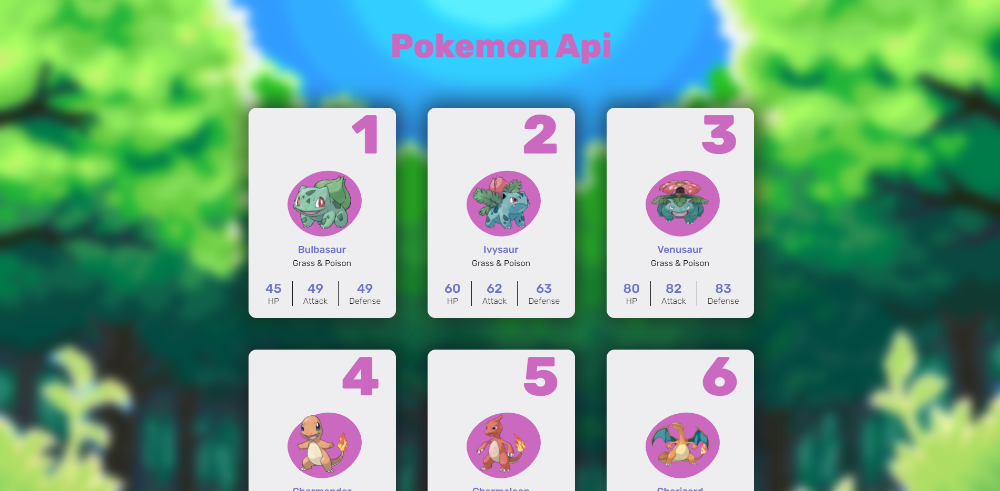
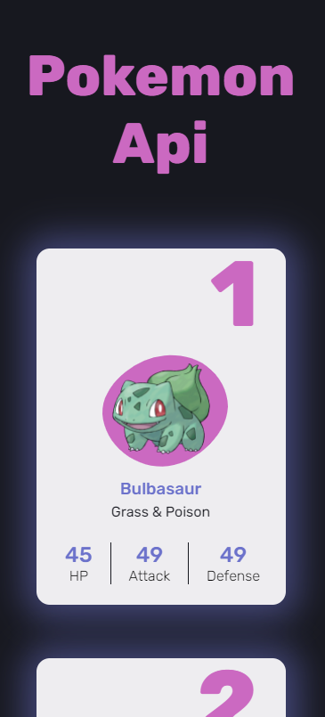
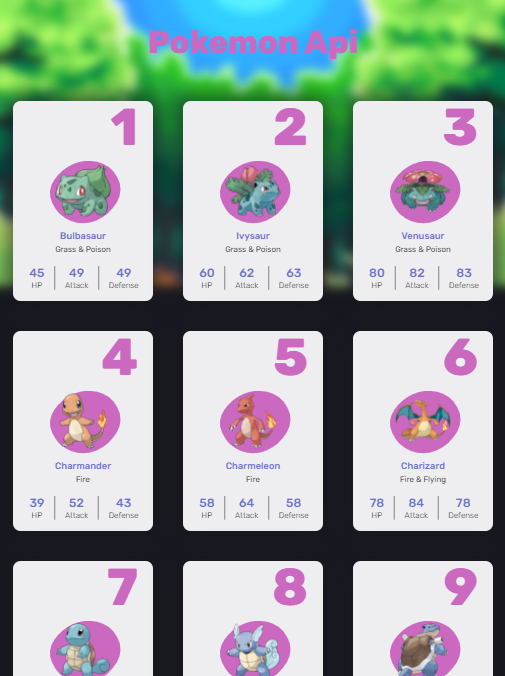

# 🐭⚡ - Pokemon-app

Pokemon-app it's a simple web app that consumes a RESTful API of Pokémon from PokéAPI. Learn more about PokéApi [here](https://pokeapi.co/about).

# 🤔 - How does the code work?

Using fetch, the code requests the card template and then clones it into the body container.
The pokemon are lazy loaded using an IntersectionObserver for the Footer.
All the code is made in **vanilla Javascript**.

```js
const loadTemplate = async () => {
    try {
        const template = await fetch("template/card.html"); // Here the card is requested
        const container = document.querySelector(".container"); // The container is selected

        container.innerHTML = await template.text(); // The fetch response is passed as string to the innerHTML
                                                    //  of the container

        const pokemon = await fetchPokemon(1); // Requesting the first pokémon of the pokedex (Bulbasur💚)
        const card = document.getElementById("template");
        setValues(card, pokemon); // Changing the values of the template with the response from fetchPokemon
    } catch (err) {
        console.error(err);
    }
};
```

> ### See more [here!](public/js)

# ⚙ - How to run it?

Install [Node.js](https://nodejs.org/en/) and after cloning the repository run the following commands in console.

```
npm i
npm start
```

# 👀 - Preview

## Desktop preview



## Phone preview



## Tablet preview



# 👨🏻‍🔧 - How to deploy it?

1. Go to [Heroku](https://dashboard.heroku.com/login).

2. Clone the repository in your Desktop.

3. After cloning the repository in your Desktop follow the steps from Heroku and deploy it.

4. Run the procfile using the following command (it's assumed that you have Heroku CLI installed and you included the NodeJS WebPack) `heroku ps:scale web=1 --app app_name` replace app_name with the name of your app. You can consult it running `heroku apps` in your CLI.

5. Enjoy!
